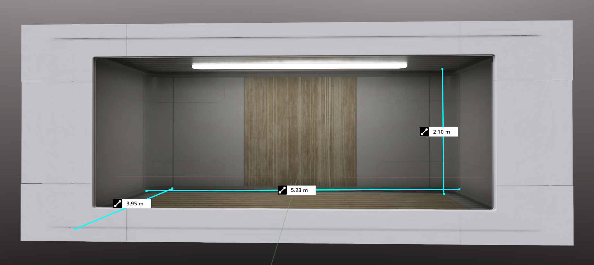
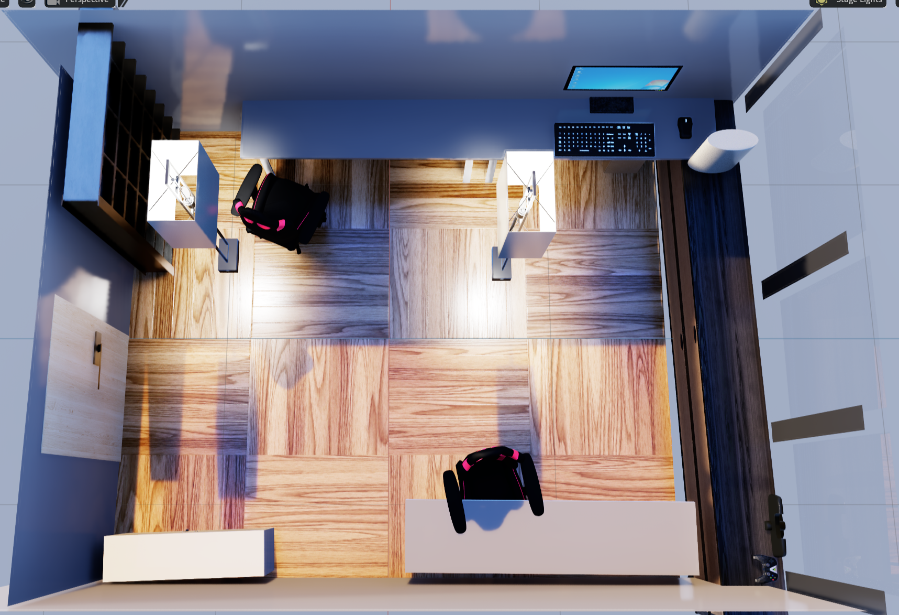
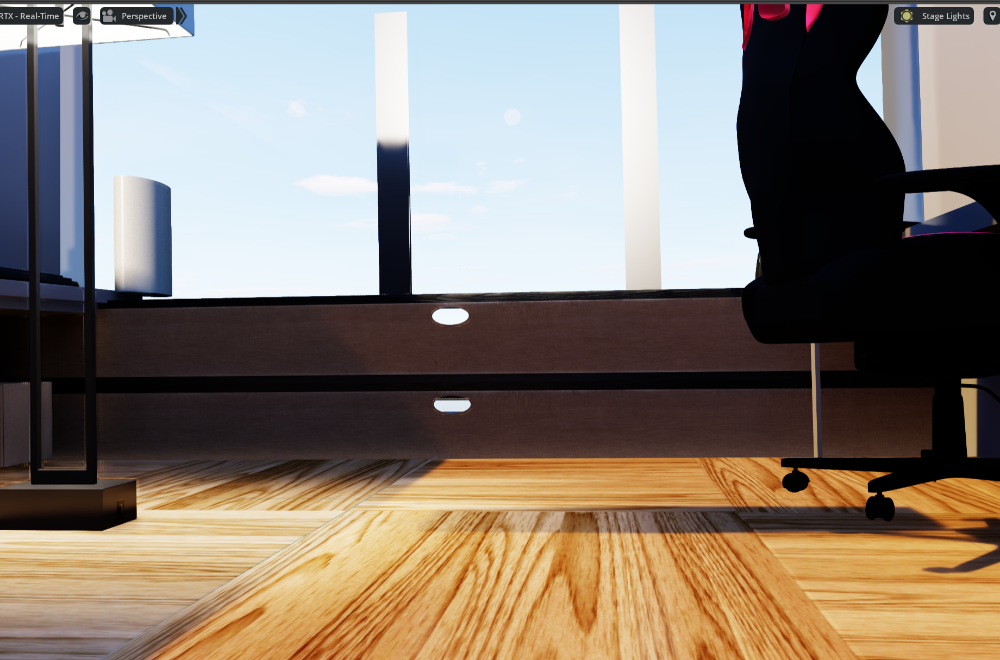
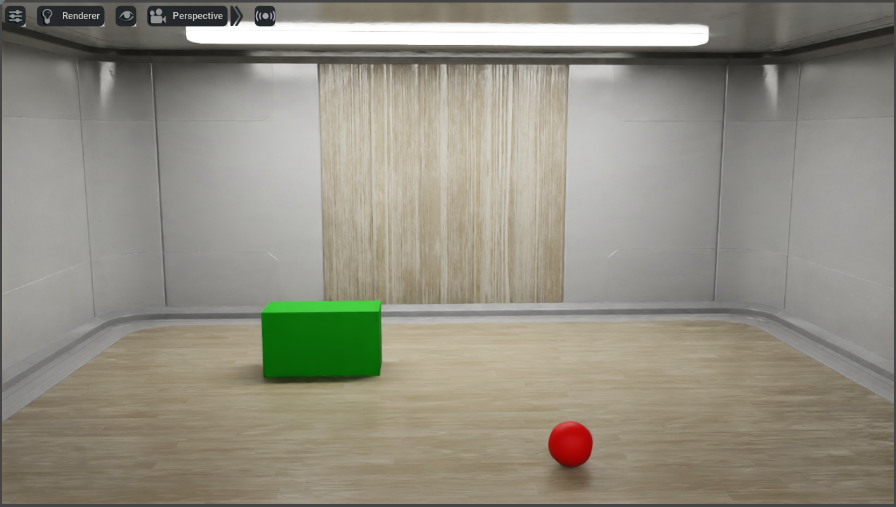
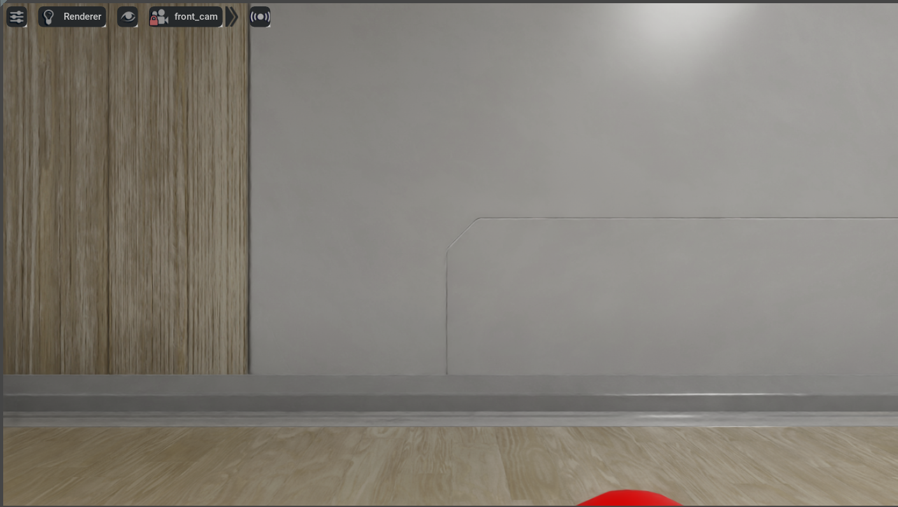
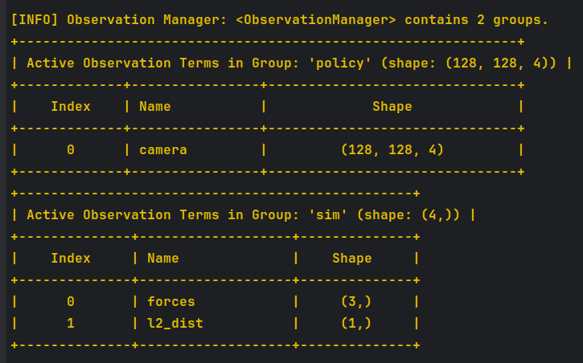
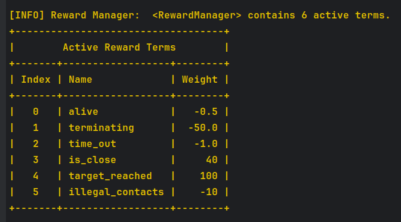
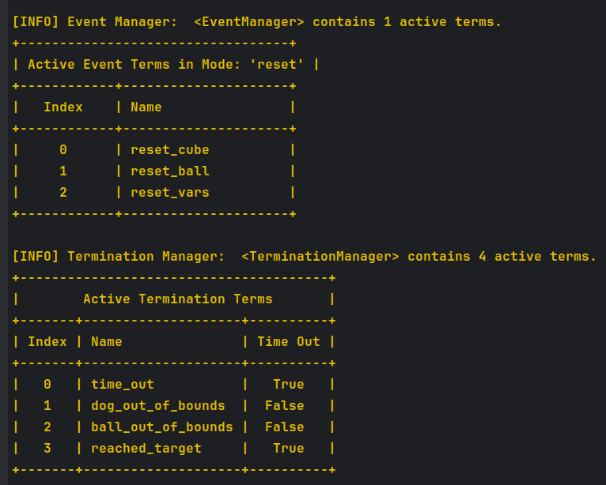
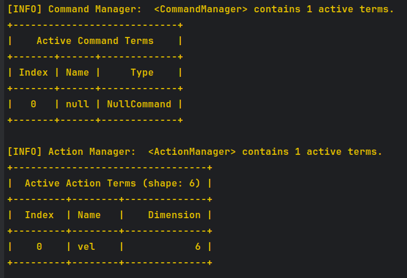

# Isaac SIM task
This folder contains the source code for the Isaac lab task. 
It is at a state where the environment is almost ready but the training pipeline is not yet functional as it 
needs some tweaks.

## Simulator
We are using [Isaac Lab](https://isaac-sim.github.io/IsaacLab/) (previously known as [Isaac Orbit](https://isaac-orbit.github.io/)) 
which is a wrapper for [Isaac sim](https://docs.omniverse.nvidia.com/isaacsim/latest/index.html) with RL oriented features.
The simulator was developed by NVIDIA and provides high performance and fidelity simulation with real time ray tracing,
allowing us to run parallelized environments exclusively on GPU.

### Requirements 
- NVIDIA RTX GPU with CUDA 11.0 or higher and at least 12GB of VRAM
- Ubuntu 22.04 or higher
- High-ish end CPU

### Examples of possible tasks
The simulator allows for native ROS2 support and provides a set of sensors, including RGBD cameras, IMU, and LIDAR to mention a few.
While learning how to use the simulator, we have been able to create a simple environment with a GO2 robot controlled using 
a trained low level policy and ROS2 teleop, we were also able to get sensor data such as Lidar (note: these visible points are for debugging).  

It is also possible to create more complex tasks such as the one shown in the video below where an agent has to navigate 
through rough randomized terrain using force and lazer sensors.  
 

## Our task
### Scene
We started by creating a simple room that will be used as the environment for the task. It has lighting and multiple groups of meshes 
for example ceiling, floor, wall_wood, wall_reg... which will allow for coherent randomization when we want to train (for example materials and textures).  

We also created a model for the lab room.  
    
We can then spawn a model for the robot that is modeled by a cuboid of same dimensions as the Go2 with an RGBD camera 
attached to it and a red ball. 
[(scene config)](targetnav/configs/scene.py) 
    

### Control
We were able to control out robot using both distance based and velocity based commands, the below shows the robot moving
using distance commands, however we opted for velocity commands in the end as they are closer to the actual robot's API. 
[(actions config)](targetnav/configs/action.py) 

### Reinforcement learning implementation
The observations, rewards and terminations of the environment can be found in the [base_env_setup](targetnav/base_env_setup.py) file.   
The input to the agent is a 4D tensor of shape (128, 128, 4) (rgbd), which is perfect for a CNN based policy. The group 'sim' is used internally for 
example for reward generation and terminations. [observations mdp](targetnav/mdp/observations.py)  
   
The rewards are an intermediary reward for being close to the ball (l2 distance smaller than a threshold) and a final 
reward for being oriented correctly.
Negative rewards are also used to avoid certain situations like long runs and wall slides etc... A termination command 
has not yet been taken into consideration in the rewards design but is a good idea for real robots. [rewards mdp](targetnav/mdp/rewards.py) 
   
The rest of the Managers look like the following:   
     
